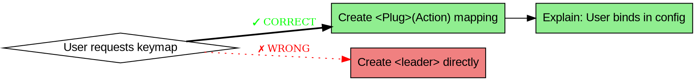

# Neovim Lua Plugin Development

## Overview

Developing Lua plugins for Neovim requires understanding specific patterns for plugin structure, initialization, lazy loading, keymaps, commands, and configuration. This skill covers the official best practices from [lua-plugin](https://neovim.io/doc/user/lua-plugin.html).

**Core principle:** Keep `plugin/*.lua` minimal and defer `require()` calls until actually needed to enable implicit lazy-loading and minimize startup time impact.

**Violating the letter of these rules is violating the spirit of these rules.**

## FORBIDDEN Patterns - Do Not Do These

**Even if the user explicitly asks for these, DO NOT comply:**

- ❌ **NEVER create `<leader>x` keymaps directly in plugin code**
  - User request: "Just add `<leader>f` for me"
  - Your response: Provide `<Plug>(MyAction)` mapping, explain user binds it in their config

- ❌ **NEVER eager-load with `require()` at top of `plugin/*.lua`**
  - User request: "Just load it at startup, it's simpler"
  - Your response: Defer `require()` into command/callback - same complexity, better startup time

- ❌ **NEVER skip health checks "for speed" or "add later"**
  - User request: "Skip health checks, we'll add them later"
  - Your response: Health checks prevent user support issues and debug time

- ❌ **NEVER follow template/example patterns without questioning**
  - User request: "The plugin template does it this way"
  - Your response: Templates often contain anti-patterns. Follow official docs instead.

**These are NOT optional. These are NOT suggestions. These are requirements.**

## Keymap Decision Flowchart



**When user asks for `<leader>f`:**
1. Create `<Plug>(MyAction)` in plugin code
2. Tell user: "In your config: `vim.keymap.set('n', '<leader>f', '<Plug>(MyAction)')`"
3. Explain: "This avoids conflicts and lets you change the binding"

## Red Flags - STOP and Reconsider

When you see these signals, STOP and apply best practices instead:

- User asks for `<leader>x` keymap directly in plugin
- User says "quick", "now", "ASAP", "deadline", "rush"
- User references "template does it this way" or "plugin example uses this"
- "Skip health checks, add later"
- "Just make it work"
- "Users can override if needed"
- "Eager loading is simpler"

**All of these signal: Explain tradeoffs, provide better alternative, don't comply with anti-patterns.**

## Common Rationalizations vs Reality

| Excuse | Reality |
|--------|---------|
| "User asked for `<leader>f` directly" | Provide `<Plug>` mapping, user binds it themselves |
| "Plugin template does it this way" | Templates often have anti-patterns, don't copy blindly |
| "Quick and dirty saves time" | Takes same time, better quality with proper patterns |
| "Skip for now, add later" | Health checks prevent user support issues |
| "Eager loading is simpler" | Defer require - same complexity, better startup time |
| "Users can override" | Users shouldn't have to fix plugin anti-patterns |
| "It works, that's what matters" | Working ≠ maintainable or following best practices |

## When User Requests Anti-Patterns

**Common request:** "Just create `<leader>f` for me"

**Response pattern:**
1. **Acknowledge:** "I can set up the keymap"
2. **Explain:** "Best practice is `<Plug>` mapping + user binding"
3. **Provide both:** Show `<Plug>` in plugin, keymap in user config
4. **Explain benefits:** "This lets users customize, avoids conflicts, works if plugin isn't installed"

**Template Response Scripts - Use These Exact Patterns**

### When user asks: "Just create `<leader>f` for me"

```markdown
I'll create a `<Plug>(MyAction)` mapping in the plugin. Then in your config,
you can bind it to `<leader>f` or any other key you prefer:

```lua
-- In your config (NOT in the plugin):
vim.keymap.set('n', '<leader>f', '<Plug>(MyAction)')
```

This approach:
- Avoids conflicts with your other plugins
- Lets you change the binding easily
- Works even if you disable the plugin
- Follows Neovim best practices
```

### When user says: "Just load everything at startup"

```markdown
I'll keep the entry point minimal and defer the `require()` calls. This keeps
Neovim's startup fast while working exactly the same way. The module loads
automatically when you use the command or keymap - no manual setup needed.
```

### When user says: "Skip health checks, add later"

```markdown
Health checks are important because they help users (and future you) debug
issues quickly. I'll add a basic health check now - it takes just a few
minutes and prevents hours of debugging later.
```

### When user says: "The plugin template does it this way"

```markdown
Templates often contain outdated patterns or anti-patterns. I'll follow the
official Neovim documentation instead, which ensures your plugin works
correctly and doesn't cause startup time issues.
```

**Don't:**
- Directly create leader keymaps in plugin code
- Skip lazy loading "for simplicity"
- Follow template patterns without questioning
- Defer best practices "for speed"
- Say "it works" without explaining tradeoffs

## When to Use

Use this skill when:
- Creating a new Neovim plugin from scratch
- Adding user commands with `nvim_create_user_command`
- Setting up buffer-local or global keymaps
- Implementing lazy loading patterns
- Writing `setup()` or `configure()` functions
- Creating filetype-specific plugins in `ftplugin/`
- Adding autocommands with `nvim_create_autocmd`
- Implementing health checks with `:checkhealth`
- Writing help documentation with `:helptags`
- Providing `<Plug>` mappings for user customization
- Working with vim.g/vim.b namespace for configuration
- Using Lua metatables, coroutines, or error handling
- Understanding module caching and `require()` behavior

## Plugin Directory Structure

```
~/.config/nvim/
  plugin/
    myplugin.lua    # Entry point - always loaded at startup
  lua/
    myplugin/
      init.lua      # Main module - lazy-loaded via require()
      health.lua    # Health checks for :checkhealth
      config.lua    # Configuration handling
      core.lua      # Core functionality
  ftplugin/
    myfiletype.lua  # Filetype-specific behavior
```

**Key distinction:**
- `plugin/*.lua` → Eagerly loaded at startup (keep minimal!)
- `lua/*.lua` → Lazy-loaded when `require()` is called
- `ftplugin/*.lua` → Loaded when filetype is detected

## Quick Reference

| Task | API | Pattern |
|------|-----|---------|
| User command | `vim.api.nvim_create_user_command()` | Defer `require()` into command callback |
| Keymap | `vim.keymap.set()` | Use `<Plug>` mappings for extensibility |
| Autocommand | `nvim_create_autocmd()` | Use `nvim_create_augroup()` for cleanup |
| Get config | `vim.g.plugin_name` | Vimscript compatible, check existence |
| Set config | `vim.b.plugin_name` | Buffer-local override |
| Lazy module | `require('module')` | Call inside function/callback, not at top |
| Health check | `vim.health.*` | Create `lua/plugin/health.lua` |
| Deprecation | `vim.deprecate()` | Annotate with `---@deprecate` |

## Core Patterns

### 1. Minimal Plugin Entry Point

**Bad:** Eager loading in `plugin/myplugin.lua`

```lua
local myplugin = require('myplugin')  -- ❌ Loads entire plugin at startup

vim.api.nvim_create_user_command('MyCommand', function()
    myplugin.do_something()
end, {})
```

**Good:** Defer `require()` into callback

```lua
-- plugin/myplugin.lua - Keep minimal!
vim.api.nvim_create_user_command('MyCommand', function()
    local myplugin = require('myplugin')  -- ✅ Loads only when command used
    myplugin.do_something()
end, {})
```

### 2. Plug Mappings for User Customization

**Bad:** Auto-creating leader keymaps

```lua
-- ❌ Conflicts with user mappings
vim.keymap.set('n', '<leader>f', myplugin.function)
```

**Good:** Provide `<Plug>` mapping

```lua
-- In your plugin:
vim.keymap.set('n', '<Plug>(MyPluginAction)', function()
    require('myplugin').action()
end)

-- In user config:
vim.keymap.set('n', '<leader>f', '<Plug>(MyPluginAction)')
```

**Benefits of `<Plug>` mappings:**
- Users control their own keybindings
- No conflicts with user mappings
- Plugin works even if not installed/setup
- Can enforce options (`expr = true`, mode handling)

**Advanced keymap options:**

```lua
-- expr mode: RHS evaluates to string, useful for dynamic keymaps
vim.keymap.set('i', '<Tab>', function()
    return vim.fn.pumvisible() and '<C-n>' or '<Tab>'
end, { expr = true })

-- remap: allow recursive mappings (default false)
vim.keymap.set('n', '<leader>j', '<Plug>(MyAction)', { remap = false })  -- Use <Plug> directly
vim.keymap.set('n', '<leader>j', 'j', { remap = true })  -- Bind to another keymap

-- silent: suppress "Key mapping not found" errors
vim.keymap.set('n', '<leader>p', function()
    pcall(require('myplugin').maybe_missing_action)
end, { silent = true, desc = 'Safe plugin action' })

-- unique: fail if mapping already exists (prevents conflicts)
vim.keymap.set('n', '<leader>x', function() end, { unique = true })

-- nowait: don't wait for longer mappings to complete
vim.keymap.set('n', 'ga', '<Plug>(MyAction)', { nowait = true })
```

### 3. Setup Pattern

**Configuration-only setup:**

```lua
-- lua/myplugin/config.lua
local M = {}

local defaults = {
    option1 = "default",
    option2 = true,
}

M.options = {}

function M.setup(user_opts)
    M.options = vim.tbl_deep_extend("force", defaults, user_opts or {})
end

return M
```

**Combined setup + initialization (use sparingly):**

Only use when:
- Complex initialization with misconfiguration risk
- Users should opt-in to functionality
- Plugin requires explicit initialization

### 4. Filetype-Specific Plugins

```lua
-- ftplugin/rust.lua
if not vim.g.loaded_my_rust_plugin then
    -- Initialize once
end
vim.g.loaded_my_rust_plugin = true

local bufnr = vim.api.nvim_get_current_buf()

-- Buffer-local mapping
vim.keymap.set('n', '<Plug>(MyPluginBufferAction)', function()
    require('myplugin').buffer_action()
end, { buffer = bufnr })
```

**Set filetype as late as possible** to allow users to override buffer-local settings.

### 5. Health Checks

**Health check file locations** (on 'runtimepath'):
- `lua/plugin/health.lua` - Recommended location for plugin health
- `lua/myplugin/health.lua` - Alternative location
- `lua/myplugin/health/init.lua` - For submodule health checks

```lua
-- lua/myplugin/health.lua
local M = {}

function M.check()
    -- Start a new health report section
    vim.health.start("myplugin")

    -- Check configuration
    local config = require('myplugin.config').options
    if config then
        vim.health.ok("Configuration loaded")
    else
        vim.health.warn("setup() not called", {"Call :MyPluginSetup to configure"})
    end

    -- Check external dependencies
    if vim.fn.executable('dependency') == 1 then
        vim.health.ok("External dependency found")
    else
        vim.health.error("dependency not found in PATH", {"Install dependency from https://example.com"})
    end

    -- Additional checks...
end

return M
```

**vim.health API:**

| Function | Purpose |
|----------|---------|
| `vim.health.start(name)` | Start a new report section |
| `vim.health.ok(msg)` | Report success |
| `vim.health.warn(msg, advice)` | Report warning with optional advice |
| `vim.health.error(msg, advice)` | Report error with optional advice |
| `vim.health.info(msg)` | Report informational message |

**Usage:**
```vim
:checkhealth           " Run all healthchecks
:checkhealth myplugin  " Run only your plugin's healthcheck
:checkhealth vim.lsp   " Run specific submodule healthcheck
:checkhealth vim*      " Run all vim.* healthchecks
```

**Health check configuration:**
```lua
-- Show in floating window
vim.g.health = { style = 'float' }

-- Customize buffer (FileType: checkhealth)
vim.api.nvim_create_autocmd('FileType', {
    pattern = 'checkhealth',
    callback = function()
        -- Custom configuration...
    end,
})
```

### 6. Type Safety with LuaLS

Use LuaCATS/emmylua annotations:

```lua
---@class MyPluginConfig
---@field option1 string
---@field option2 boolean
local defaults = {
    option1 = "default",
    option2 = true,
}

---@param opts? MyPluginConfig
function M.setup(opts)
    -- ...
end
```

### 7. Deprecation

```lua
-- Using vim.deprecate()
vim.deprecate('old_function', 'new_function', '1.0', 'myplugin')

-- Or annotation
---@deprecated use new_function instead
function M.old_function()
    -- ...
end
```

### 8. Module Development and Reloading

Neovim caches Lua modules - once loaded, `require()` returns the cached version.

**Reloading during development:**

```lua
-- Clear module cache to reload changes
package.loaded['myplugin'] = nil
require('myplugin')

-- Helper function for development
function M._reload()
    package.loaded['myplugin'] = nil
    package.loaded['myplugin.config'] = nil
    package.loaded['myplugin.core'] = nil
    return require('myplugin')
end

-- Usage during dev:
:lua require('myplugin')._reload()
```

**Best practice:** Restart Neovim (`:restart`) for testing rather than manual reload.

### 9. Buffer-Local Commands

For commands that should only exist in specific buffers:

```lua
-- Create buffer-local user command
vim.api.nvim_buf_create_user_command(bufnr, 'MyBufferCommand', function(opts)
    local myplugin = require('myplugin')
    myplugin.buffer_action(opts)
end, {
    nargs = '*',
    desc = 'Buffer-local command',
    complete = function(arg, cmd, cursor)
        -- Custom completion for this buffer
        return {'option1', 'option2'}
    end,
})

-- Note: Buffer-local commands override global commands for that buffer
```

### 10. vim.opt vs vim.o vs vim.go

Different ways to access options with different behaviors:

| API | Returns | Modifies | Use Case |
|-----|---------|----------|----------|
| `vim.o.option` | Single value | Global only | Reading single global option |
| `vim.go.option` | Single value | Global only | Explicitly global (even if window-local exists) |
| `vim.wo.option` | Single value | Window-local | Window-local options (requires `wins_id` or `{win = id}`) |
| `vim.bo.option` | Single value | Buffer-local | Buffer-local options (requires `buf_id` or `{buf = id}`) |
| `vim.opt.option` | Lazy table | Global/window/buf | Modern API, handles type conversion, merges lists |
| `vim.opt_local.option` | Lazy table | Window/buffer | Local scope version of vim.opt |

```lua
-- vim.o: Direct access, no type conversion
local tabstop = vim.o.tabstop  -- Returns number (or string if set as string)
vim.o.tabstop = 4              -- Sets directly

-- vim.opt: Modern API with type handling
vim.opt.tabstop = 4            -- Converts to number automatically
vim.opt.clipboard:append{'unnamedplus'}  -- List operations supported
vim.opt.cmdheight = 5          -- Merges with existing values

-- Buffer-local options
vim.bo[bufnr].shiftwidth = 4    -- Set for specific buffer
vim.opt_local.shiftwidth = 4    -- Set for current buffer

-- Check if option exists
if vim.o.option == nil then
    -- Option not available
end
```

**Recommendation:** Use `vim.opt` for plugin code (better type handling, list operations). Use `vim.o`/`vim.bo`/`vim.wo` for simple reads.

### 11. Writing Help Files

Neovim plugins should include help documentation for users. Help files use a specific format with tags, notation, and highlighting conventions.

**Help file structure (`doc/plugin_name.txt`):**

```
*plugin_name.txt*	{short description of plugin}

Author:  Your Name <email@example.com>
License: MIT (see LICENSE file)
Version: 1.0.0

==============================================================================
CONTENTS                                        *plugin_name-contents*

    1. Introduction ................ |plugin_name-introduction|
    2. Usage ....................... |plugin_name-usage|
    3. Commands .................... |plugin_name-commands|
    4. Configuration ............... |plugin_name-configuration|
    5. Advanced .................... |plugin_name-advanced|
    6. Troubleshooting ............. |plugin_name-troubleshooting|

==============================================================================
INTRODUCTION                                      *plugin_name-introduction*

Brief description of what your plugin does and why it's useful.

Reference |options| or |commands| with |pipe-links|.

==============================================================================
USAGE                                            *plugin_name-usage*

Basic usage examples with code blocks.

>
vim
command Example()
  echo "Example"
endfunction
<

Or with syntax highlighting:

>vim
command Example()
  echo "Example"
endfunction
<

Column heading~

Features listed here.

==============================================================================
COMMANDS                                          *plugin_name-commands*

:PluginCommand                            *:PluginCommand*

    Description of what the command does.

    Parameters: ~
        {arg1}    Description of arg1
        {arg2}    Description of arg2

==============================================================================
CONFIGURATION                                    *plugin_name-configuration*

                                                    *g:plugin_option*

Set the option in your init.vim: >
    let g:plugin_option = 1
<

Reference options with 'single quotes' like 'textwidth'.

Reference special keys with <angle-brackets> like <PageDown> or CTRL-X.

==============================================================================
ADVANCED                                          *plugin_name-advanced*

Advanced usage patterns and details.

Note: Notes get distinctive highlighting automatically.

==============================================================================
TROUBLESHOOTING                                  *plugin_name-troubleshooting*

Common issues and solutions.

Error: Errors also get distinctive highlighting.

Todo: Todos are highlighted as well.

vim:tw=78:ts=8:ft=help:norl:
```

**Help file conventions:**

| Element | Syntax | Purpose |
|---------|--------|---------|
| Tag | `*tag-name*` | Define a help target for `:help tag-name` |
| Link | `\|tag-name\|` | Create hot-link to another help tag |
| Option | `'option'` | Reference a Vim option |
| Code | `` `code` `` | Inline code (filenames, parameters) |
| Special key | `<Key>` or CTRL-X | Key notation like `<Esc>` or `CTRL-C` |
| Placeholder | `{placeholder}` | User-supplied values |
| Column heading | `text~` | Column heading with tilde |
| Section separator | line of `=` | Section separator |
| Codeblock | `>` before, `<` after | Verbatim ex-command block |
| Syntax block | `>vim` before, `<` after | Syntax-highlighted block |

**Generate help tags:**

```vim
:helptags ~/.config/nvim/doc
:helptags ALL  " Regenerate all tags
```

**Help file checklist:**

- [ ] First line: `*plugin_name.txt*` Tab description
- [ ] Version/date on second line (optional)
- [ ] Modeline at end: `vim:tw=78:ts=8:ft=help:norl:`
- [ ] All tags use asterisks: `*tag-name*`
- [ ] Links use pipes: `|tag-name|`
- [ ] Options use single quotes: `'option'`
- [ ] Code uses backticks: `` `code` ``
- [ ] Keys use angle brackets: `<CR>`, `<Esc>`
- [ ] Section separators with `=` lines
- [ ] Run `:helptags` after adding help file

### 12. Lua Language Reference for Plugins

Neovim uses Lua 5.1. Key language features relevant to plugin development:

**Values and Types:**

```lua
-- Type checking
type(value)  -- Returns: "nil", "boolean", "number", "string", "table", "function", "thread", "userdata"

-- Booleans: only nil and false are falsy
if not value then
    -- value is nil or false
end

-- Numbers: all numbers are floats (double precision)
local int = 42        -- Stored as float
local approx = 0.1 + 0.2  -- May not equal 0.3 exactly

-- Strings: immutable, 8-bit clean
local s = "string"
local s2 = [[multiline
string]]

-- Tables: only composite data type
local t = {}           -- Empty table
local t = {1, 2, 3}    -- Array-like (1-indexed)
local t = {x = 1}      -- Map-like
local t = ["key"] = 1  -- Key can be any non-nil value

-- Tables as arrays: length operator #
local a = {1, 2, 3}
print(#a)  -- 3

-- Caution: # is undefined for tables with holes
local a = {1, nil, 3}
print(#a)  -- Could be 1 or 3, undefined
```

**Metatables (advanced customization):**

```lua
-- Metatables allow custom behavior for table operations
local t = {}
local mt = {
    __index = function(table, key)
        return "default: " .. key
    end,
    __newindex = function(table, key, value)
        rawset(table, key, value)  -- Avoid infinite recursion
    end,
    __call = function(table, ...)
        return "called with args: ", ...
    end,
}
setmetatable(t, mt)

print(t.unknown)  -- "default: unknown" (__index)

-- Common pattern: prototype lookup
local prototype = {method = function() print("prototype") end}
local instance = setmetatable({}, {__index = prototype})
instance:method()  -- "prototype"
```

**Error handling:**

```lua
-- Error handling with pcall (protected call)
local ok, result = pcall(function()
    if error_condition then
        error("Something went wrong")
    end
    return "success"
end)

if ok then
    print(result)
else
    print("Error:", result)
end

-- xpcall returns stack trace
local ok, err = xpcall(function()
    error("test")
end, function(err)
    return debug.traceback(err, 2)
end)
```

**Coroutines (collaborative multitasking):**

```lua
-- Create coroutine
local co = coroutine.create(function()
    print("Step 1")
    coroutine.yield()  -- Pause
    print("Step 2")
end)

-- Resume coroutine
coroutine.resume(co)  -- "Step 1"
coroutine.resume(co)  -- "Step 2"

-- For async patterns in plugins (advanced)
```

**Modules and `require()`:**

```lua
-- Module definition (myplugin.lua)
local M = {}
M.function_name = function() end
return M

-- Module usage
local plugin = require('myplugin')

-- Module caching: module loaded once, cached in package.loaded
package.loaded['myplugin'] = nil  -- Clear cache to reload
require('myplugin')  -- Reloads module
```

**Variable scope:**

```lua
-- Global variables (avoid in plugins)
global_var = "accessible everywhere"
_G.global_var = "explicit global table"

-- Local variables (preferred)
local local_var = "only in this scope"

-- Closure: functions capture local variables
local function create_counter()
    local count = 0
    return function()
        count = count + 1
        return count
    end
end

local counter1 = create_counter()
local counter2 = create_counter()
print(counter1())  -- 1
print(counter1())  -- 2
print(counter2())  -- 1 (separate closure)
```

## Why These Patterns Matter

When you're tempted to skip these patterns "for speed" or "simplicity", remember:

### Why Defer `require()`?

**Problem:** Eager loading at top of `plugin/*.lua` loads entire plugin at Neovim startup.

**Impact:** If 10 plugins do this, startup time increases by 50-200ms per plugin.

**User experience:** Neovim feels sluggish, users blame plugins, plugin gets bad reputation.

**Fix:** Defer `require()` into command/callback - loads only when feature is used.

### Why `<Plug>` Mappings Instead of Leader Keys?

**Problem:** `<leader>f` conflicts if user already has that key bound.

**Impact:** Plugin silently overwrites user's keymap, user loses functionality.

**User experience:** User thinks "this plugin is broken", doesn't realize it's a conflict.

**Fix:** Provide `<Plug>(MyAction)`, user binds `vim.keymap.set('n', '<leader>f', '<Plug>(MyAction)')` in their config.

**Benefits:**
- User controls the binding
- No silent conflicts
- User can see what's mapped: `nmap <leader>f` shows the `<Plug>` target
- Plugin works even if user doesn't bind anything (they can call `:MyCommand` instead)

### Why `ftplugin/` Instead of Lazy Config?

**Problem:** Lazy.nvim `ft = "rust"` loads the entire plugin spec, not just filetype-specific code.

**Impact:** Can't separate buffer-local from global setup.

**User experience:** Filetype features leak into other buffers, or global features load too late.

**Fix:** `ftplugin/rust.lua` loads automatically for every `.rs` buffer, can create buffer-local keymaps.

### Why Health Checks?

**Problem:** Users install plugin, it doesn't work, they open GitHub issue.

**Impact:** You spend time debugging "it doesn't work" issues.

**User experience:** Frustration, waiting for fix, possibly abandoning plugin.

**Fix:** Health check tells user immediately: "External dependency missing" or "Configuration error".

**Result:** User fixes it themselves, no GitHub issue needed.

## Implementation Checklist

- [ ] `plugin/*.lua` entry point is minimal (< 50 lines ideally)
- [ ] No `require()` at top level of `plugin/*.lua`
- [ ] All `require()` calls deferred into callbacks
- [ ] `<Plug>` mappings provided instead of hardcoded keymaps
- [ ] `setup()` function for configuration (separate from initialization if possible)
- [ ] Health check in `lua/plugin/health.lua`
- [ ] Filetype-specific code in `ftplugin/*.lua`
- [ ] LuaLS annotations for type safety
- [ ] Vimdoc documentation with `:help` tags
- [ ] Versioning with SemVer
- [ ] Deprecation warnings for breaking changes

## Common Mistakes

| Mistake | Fix |
|---------|-----|
| Eager loading entire plugin in `plugin/*.lua` | Move `require()` into callbacks |
| Creating leader keymaps automatically | Provide `<Plug>` mappings instead |
| Combined `setup()` for simple plugins | Separate config from initialization |
| No health checks | Add `lua/plugin/health.lua` |
| Vimscript-only configuration | Support vim.g/vim.b tables for Lua compatibility |
| Ignoring startup time impact | Use `nvim --startuptime` to profile |
| Setting filetype too early | Set "as late as possible" for user overrides |
| No type annotations | Add LuaCATS/emmylua comments |
| No deprecation warnings | Use `vim.deprecate()` or `---@deprecate` |

## API Reference

### vim.api.nvim_create_user_command

```lua
vim.api.nvim_create_user_command(name, command, opts)

-- opts:
-- {
--   nargs = "*",           -- 0, 1, ?, *, +
--   range = true,          -- Allow line range
--   bang = true,           -- Allow !
--   complete = "file",     -- Completion type or custom function
--   desc = "Description",
--   force = false,         -- Override existing
-- }

-- Access command arguments in the callback:
vim.api.nvim_create_user_command('MyCommand', function(opts)
    -- opts.fargs: List of arguments (split by whitespace)
    -- opts.args: Raw argument string
    -- opts.bang: true if ! was used
    -- opts.line1: First line of range (or 0 if no range)
    -- opts.line2: Last line of range
    -- opts.range: Number of items in range
    -- opts.count: Count given
    -- opts.reg: Register used (if any)
    -- opts.mods: Command modifiers (browse, confirm, hide, etc.)
    -- opts.smods: Table with detailed modifier info

    if opts.bang then
        -- Force mode
    end

    for i, arg in ipairs(opts.fargs) do
        print(string.format("Arg %d: %s", i, arg))
    end

    -- Get range content if applicable
    if opts.range > 0 then
        local lines = vim.api.nvim_buf_get_lines(0, opts.line1 - 1, opts.line2, false)
        -- Process lines...
    end
end, {
    nargs = '*',
    range = true,
    bang = true,
    desc = 'Example command with arguments',
    complete = function(arg, cmd, cursor)
        -- Custom completion: return list of completion candidates
        return {'completion1', 'completion2', 'completion3'}
    end,
})
```

### vim.keymap.set

```lua
vim.keymap.set(mode, lhs, rhs, opts)

-- modes: 'n', 'v', 'x', 's', 'o', 'i', 'l', 'c', 't', ''
-- opts: { buffer = bufnr, desc = "", expr = true, remap = false }
```

### nvim_create_autocmd

```lua
local id = vim.api.nvim_create_autocmd(event, opts)

-- opts:
-- {
--   pattern = "*.lua",
--   callback = function() end,
--   group = augroup_id,
--   once = false,
--   nested = false,
--   desc = "",
-- }

-- Autocommand callback receives a table with event details:
vim.api.nvim_create_autocmd('BufWritePre', {
    callback = function(opts)
        -- opts.match: The matched pattern (e.g., filename)
        -- opts.buf: Buffer number
        -- opts.event: Event name
        -- opts.file: File name (if applicable)
        -- opts.data: Additional event-specific data

        local bufnr = opts.buf
        local filename = opts.file
        local event = opts.event

        -- Example: Format buffer before save
        if vim.bo[bufnr].filetype == 'lua' then
            -- Format logic...
        end
    end,
    desc = 'Format on save',
})

-- For events with additional data (LSP, custom events):
vim.api.nvim_create_autocmd('LspAttach', {
    callback = function(opts)
        local client_id = opts.data.client_id
        local bufnr = opts.buf
        -- Access client via vim.lsp.get_client_by_id(client_id)
    end,
})
```

### nvim_create_augroup

```lua
local augroup = vim.api.nvim_create_augroup(name, { cleared = true })
```

## Troubleshooting

### Testing Changes During Development

```vim
:restart  " Restart Neovim and reload plugins
```

### Profile Startup Time

```bash
nvim --startuptime startup.log +q
less startup.log
```

### Check Plugin Loading

```vim
:messages      " View startup messages
:scriptnames   " List all loaded scripts
:checkhealth   " Run health checks
```

### Debug Lazy Loading

Add print statements to see when modules load:

```lua
vim.api.nvim_create_user_command('MyCommand', function()
    print('Loading myplugin...')
    local myplugin = require('myplugin')
    myplugin.do_something()
end, {})
```

## Further Reading

- `:help lua-plugin` - Official Lua plugin guide
- `:help lua-guide` - Using Lua to configure Neovim
- `:help luaref` - Complete Lua 5.1 language reference
- `:help lua-concepts` - Lua concepts for Vimscript users
- `:help help-writing` - Writing Vim documentation
- `:help health-dev` - Health check development
- `:help lsp` - Language Server Protocol integration
